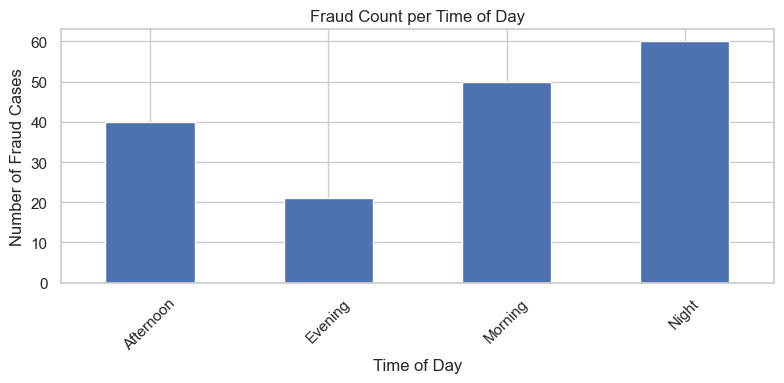
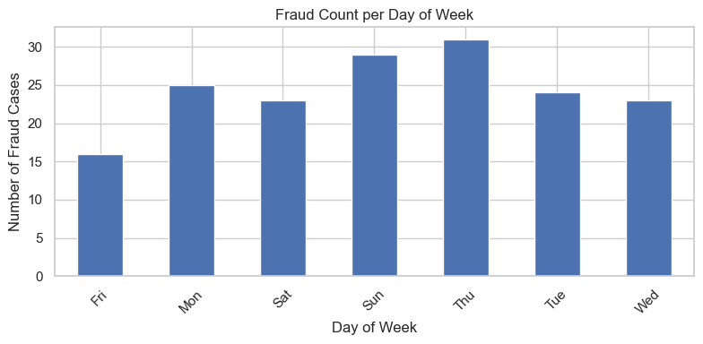
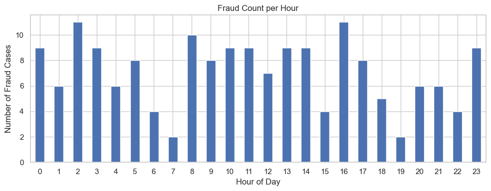
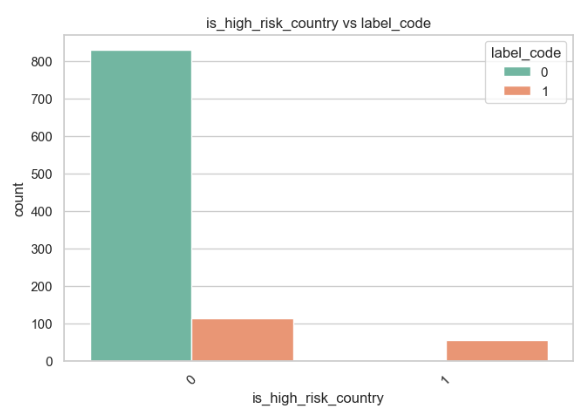
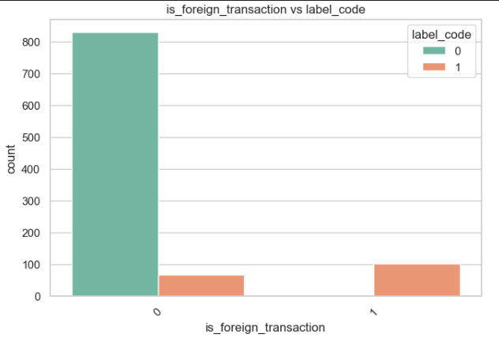
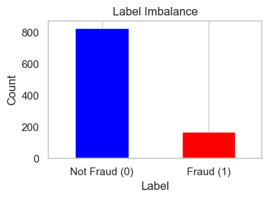
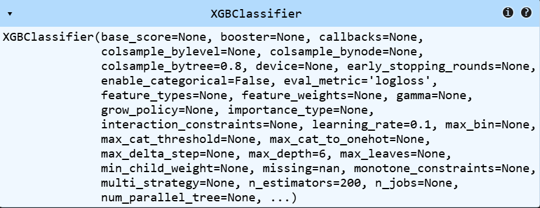
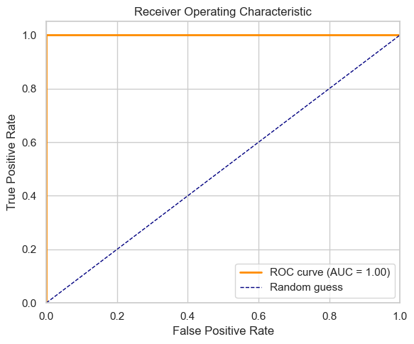
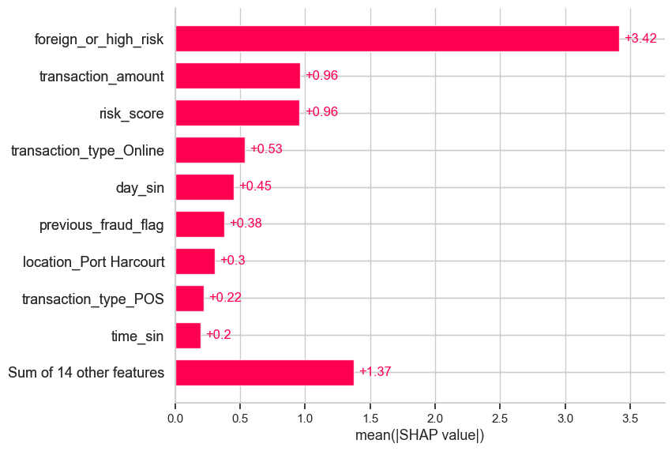

# FRAUD DETECTION IN FINTECH PLATFORMS

## PROJECT OVERVIEW

This project is a Fraud Detection System designed to identify potentially fraudulent financial transactions in real-time using machine learning. Built with a production-grade architecture, the system offers:

- An XGBoost model trained on transactional features.

- Feature engineering with scaling, encoding, and time-based transformations.

- SHAP-based explanations for model predictions.

- A FastAPI backend that returns fraud risk and interpretability info.

- A Streamlit dashboard for manual input, predictions, and visual insights.

The system is built for financial institutions and fintechs to detect and understand fraud effectively.

##

## DATA UNDERSTANDING AND PROCESSING

EDA was carried out on the data and these are the following insights:

- Dataset had 1000 entries
- Dataset had 13 features: transaction_id, customer_id, transaction_amount,transaction_type, device_type, location, time_of_day, day_of_week, is_foreign_transaction, is_high_risk_country, previous_fraud_flag, transaction_time, risk_score
- Dataset had 1 target variable: label_code which is a binary classification target
- Dataset had no null values
- Dataset had no duplicate values
- Dataset had fraud cases: 171 and non-fraud cases: 829
- Database has 2 numerical features, 1 datetime feature and 10 categorical features
- The non binary categorical features include:

```
    transaction_type: 4 classes - ['Online' 'POS' 'ATM' 'Transfer']
    device_type: 4 classes - ['Mobile' 'ATM Machine' 'POS Terminal' 'Web']
    location: 5 classes - ['Abuja' 'Lagos' 'Ibadan' 'Kano' 'Port Harcourt']
    time_of_day: 4 classes - ['Afternoon' 'Evening' 'Morning' 'Night']
    day_of_week: 7 classes - ['Fri' 'Tue' 'Wed' 'Sun' 'Thu' 'Mon' 'Sat']
```

- The binary categorical features include:

```
    is_foreign_transaction: 2 classes - [0 1]
    is_high_risk_country: 2 classes - [0 1]
    previous_fraud_flag: 2 classes - [0 1]
```

- customer_id and transaction_id had more than 100 different classes

### Data Preprocessing

- The transaction_time feature was converted into datetime format using pd.to_datetime() function.
- the transaction_time was then used to validate the time_of_day and day_of_week features. This showed that the time_of_day and day_of_week features were not consistent with the transaction_time feature. Therefore, the time_of_day and day_of_week features were modified using the transaction_time feature.

```
    Timestamp: 2024-02-04 22:00:00

    Day of the week from timestamp: Sun
    Day of week from dataFrame: Fri
    Validity: False

    Time of day from timestamp: Night
    Time of day from dataframe: Afternoon
    Validity: False
```

##

## TEMPORAL ANALYSIS RESULTS

Here are the results of the temporal analysis:

- Nights and mornings have the highest risk case of fraud transactions while evenings have the lowest risk case of fraud transactions.
  
- Sundays and thursdays have the highest risk case of fraud transactions while fridays have the lowest risk case of fraud transactions.
  
- There were no trends of fraud transactions with respect to weekend or weekdays.
- There were no trends of fraud transactions with respect to hour of the day.
  

##

## FEATURE ENGINEERING

The following categorical columns were converted to numerical columns using one hot encoding:

- transaction_type
- device_type
- location
  this was because they have 4-5 classes which where unrealed to one another

time_of_day and day_of_week features were converted to numerical columns using cyclical encoding because these features are cyclic in nature and the models need to understand this relationship (i.e monday is close to sunday and far from thursday)

The transaction_amount featurewas scaled using RobustScaler beacsue of the skewness of the data. this feature had a mean = 72.595107, std = 73.350547, and max = 608.378011.

is_high_risk_country, is_foreign_transaction, previous_fraud_flag, and label_code were not modified as they are binary features.

risk_score was not modified as it is an already scaled numerical feature.

transaction_id, customer_id, and transaction_time were dropped as they are not relevant to the model.

is_high_risk_country and is_foreign_transaction were combined into a single feature called is_high_risk_transaction. This was done because during EDA I notice transactions that is_high_risk_country and is_foreign_transaction are most likely to be fraud. so this combination acts like a risk level feature to the model by combining the two models using the logical or (+) operator.
 

##

## DATA IMBALANCE HANDLING

The dataset is imbalanced with a fraud rate of 17.1%.



This is a common problem in fraud detection. To handle this, SMOTEENN whcih is a combination of SMOTE (Synthetic Minority Over-sampling Technique) and ENN (Edited Nearest Neighbors) was used to oversample the minority class and undersample the majority class.
this method was selected because:

- I want cleaner decision boundaries by removing confusing majority samples.
- You're dealing with moderate-to-severe class imbalance (17%).
- it works best for this use case case (fraud detection).
- I'm using complex models (XGBoost) that benefit from more refined class separation.

##

## MODELING SELECTION AND TRAINING STRATEGY

The model used for this project is XGBoost. This was chosen because it is a powerful and flexible algorithm that can handle complex relationships between features and the target variable. It also has built-in support for handling imbalanced datasets, which is a common problem in fraud detection. It has high performance on tabular data, Compatibility with SHAP for explainability and Compatibility with SHAP for explainability.



### Training strategy

- The dataset was split into train and test sets with a 80/20 split.
- The model was trained on the train set and evaluated on the test set.
- The model was trained with the following hyperparameters:

```
    n_estimators = 200
    learning_rate = 0.1
    max_depth = 6
    subsample = 0.8
    colsample_bytree = 0.8
    eval_metric = 'logloss'
```

### MODEL EVALUATION

The model was evaluated using the following metrics:

- Accuracy
- Precision
- Recall
- F1-score
- AUC-ROC

This wa sthe model's confusion matrix:

```
[[166   0]
 [  0  34]]

TP: 166, FP: 0, TN: 34, FN: 0

Precision: 1.0
Recall: 1.0
F1-score: 1.0
AUC-ROC: 1.0
```



##

## EXPLAINABILITY INSIGHTS

To understand the model's predictions, SHAP (SHapley Additive exPlanations) values were used to quantify the contribution of each feature. The summary plot below reveals the following key insights:


### Key Findings

- foreign_or_high_risk is the most influential feature, indicating that transactions from flagged countries or high-risk regions strongly influence fraud predictions.

- transaction_amount and risk_score are equally impactful, suggesting that larger transaction values and elevated risk scores are major signals for fraudulent activity.

- transaction_type_Online has a higher influence compared to POS, implying online transactions carry a higher fraud risk in the dataset.

- Time-based features like day_sin and time_sin show that the model captures temporal fraud patterns—certain hours or days may be more prone to fraudulent activity.

- contributes meaningfully, showing that accounts with a fraud history are more likely to be flagged.

- Location-specific behavior, such as transactions from Port Harcourt, also appears relevant.

- While individually smaller, the collective effect of 14 other features contributes significantly to the model's decisions.

This level of explainability helps validate that the model is aligning with domain knowledge and highlights which features are most actionable for risk teams.

##

## DEPLOYMENT INSTRUCTIONS

**Clone the Repository**

```bash
git clone https://github.com/Chigoziee/QAT-Ed.git
cd QAT-Ed
```

**Create Virtual Environment**

```bash
 python -m venv .venv
 source .venv/bin/activate  # or .venv\Scripts\activate on Windows
```

**Install Dependencies**

```bash
pip install -r requirements.txt
```

### **Run Streamlit App**

```bash
streamlit run streamlit_app.py
```

The app allows:

- Manual input of transaction data

- Viewing fraud predictions and risk - explanations

- Monitoring daily fraud trends

### **Run FastAPI Server**

```bash
uvicorn api_server:app --reload
```

The FastAPI server will be accessible at http://localhost:8000 for testing and Swagger documentation.

The API:

- Accepts transaction JSON payloads
- Returns fraud predictions and SHAP explanations

##

## ASSUMPTIONS AND LIMITATIONS

- The system only takes in data consistent with the training data schema.

- The system is limited to static model; retraining requires manual updates.

- Model performance may degrade on unseen patterns or evolving fraud techniques due to lack of continuous monitoring and updating.

- Categorical values outside the fitted encoder’s vocabulary are ignored.

## FUTURE IMPROVEMENTS

To enhance the system's versitility, performance, and usability, the following improvements are proposed:

### Model Enhancements

- Explore advanced models like LightGBM, CatBoost, or ensemble stacking.

- Add anomaly detection (e.g., Isolation Forest, Autoencoders).

- Implement online/incremental learning for real-time adaptation.

### Data

- Include user behavior metrics (avg transaction size, frequency).

- Automate data ingestion, preprocessing, and retraining.

- Integrate real-time data streams (e.g., Kafka) for live scoring.

### Dashboard/API Improvements

- Add user authentication and secure access.

- Show historical risk trends and enable batch scoring via CSV.

- Add real-time evaluation using recent transaction data.

- Deploy on cloud platforms for availability and monitoring.
